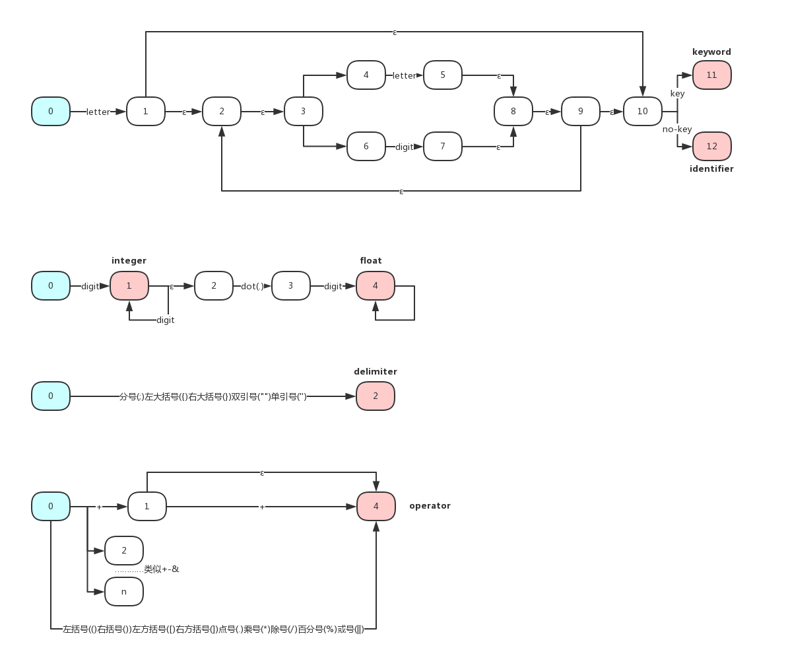
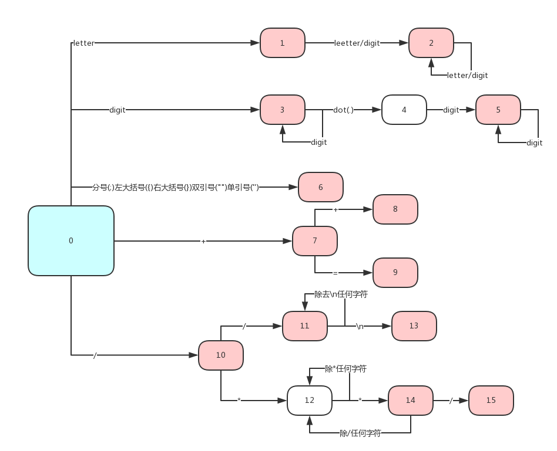
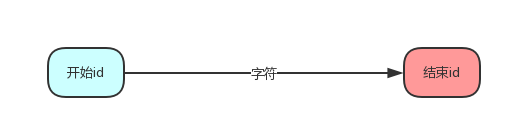
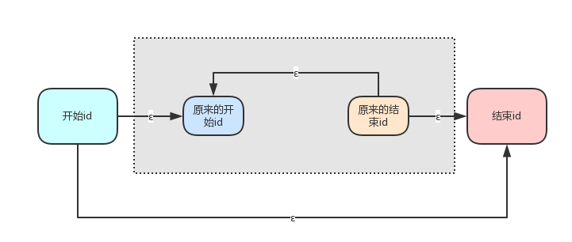

# 编译原理第一次实验报告

[TOC]

## 概述

​	这是编译原理的第一次实验报告

​	基本部分是第一部分:基于C语言子集的词法分析程序。这部分选取了C语言的一个子集给出了词法分析程序，对**给定的一段C语言代码(元素均在此子集中)**，输出是**该段代码的token序列**，以便后面的文法分析使用。

​	扩展部分是第二部分:LEX的部分实现。这部分对**给定的一个正则表达式**，**输出了其DFA的转化表**，由于时间所限，没有实现词法分析程序的生成程序，并且NFA到DFA部分仅支持a，b两个字母构成的字母表。

## 实验环境

​	实验环境是**Windows10**系统，使用的语言是**Java**语言

## 第一部分: 基于C语言子集的词法分析程序

### 1. 假设与依赖

> 假设了实验使用的C语言子集
>
> 两个输入之间均用1个空格隔开

| Token     | 包含的输入                                    |
| --------- | ---------------------------------------- |
| **关键字**   | break case char const continue default do double else enum float for goto if int long main short signed sizoef static switch unsigned void |
| **操作符**   | ( ) [ ] . ! + ++ - -- * / % < <= > >= = == != & && \|\| , |
| **分隔符**   | ; { }                                    |
| **注释符**   | // /* */ “ ” ‘ ’                         |
| **忽略的字符** | \n \t blank                              |
| **整数**    | 所有整数(仅限正数)                               |
| **浮点数**   | 所有浮点数(仅限正数)                              |
| **标识符**   | 由数字,大小写英文字母和和下划线组成的并且由字母或下划线开头的任意字符串(不包含关键字) |

### 2. 思路与方法

> 本部分叙述了实验的正则表达式构造和主要思路

#### 2.1 正则表达式的构造

分成两个部分

**第一部分是有限长度，有限数目的token**

| Token   | 正则表达式                                    |
| ------- | ---------------------------------------- |
| **关键字** | break\|case\|char\|const\|continue\|default\|do\|double\|else\|enum\|float\|for\|goto\|if\|int\|long\|main\|short\|signed\|sizoef\|static\|switch\|unsigned\|void |
| **操作符** | (\|)\|[\|] .\|!\|+\|++\|-\|--\|*\|/\|%\|<\|<=\|>\|>=\|=\|==\|!=\|&\|&&\|\|\|\| , |
| **分隔符** | ;\|{\|}\|“\|”\|‘\|’                      |
| **注释符** | // \| /* \| */                           |

**第二个部分是无限长度，无限数目的token**

| Token   | 正则表达式                                   |
| ------- | --------------------------------------- |
| **整数**  | *digit*(*digit*)                        |
| **浮点数** | *digit* (*digit*)* . *digit* (*digit*)* |
| **标识符** | *letter*(*letter*\|*digit*)*            |

其中*digit*->0|1|2|3|4|5|6|7|8|9，letter->a|b|c…|z|A|B|C…|Z|_

#### 2.2 思路叙述

思路如下:


- 初始化常量
- 将文本的C程序代码读取成为**字节数组**
- 从左至右扫描**一遍**数组，利用**DFA**确定其归属的Token种类，并与原来的词法元素合并成为一个token，写入**输出字符串列表**中
- 将**输出字符串列表**中的字符串按照从前往后的顺序输出到文本

### 3. 自动状态机DFA构造描述

> 本部分详细叙述了从Regular Expression到DFA的过程

#### 3.1 RE->NFA



#### 3.2 NFA->DFA



### 4. 数据结构描述

#### 4.1 状态枚举

```Java
    enum STATE{
    	DONE,//正常情况
    	INVAR,//标识符或者关键字
        INADD,INMINUS,//加减符号
        INLESS,INMORE,INEQUAL,//小于大于等于
        INEXCLAMATORY,//惊叹号
        INAND,INOR,//且 或
        INSOLIDUS,//斜线
        INDIGIT,//数字
        INDECIMALS,//小数
        ANNOTATION_ONE_LINE,ANNOTATION_MULTI_LINE,ANNOTATION_MULTI_LINE_ASTERISK,//各种注释
        SINGLE_QUOTE_MARK,DOUBLE_QUOTE_MARK//单引号双引号
    }
```

其中省略了很多符号例如`{ } %`d的状态，因为这些字符一旦被扫描到那么直接结束判定为某字符不用状态转换

#### 4.2 种类枚举以及map

```java
enum TOKEN{
        KEYWORDS,//关键字
        IDENTIFIER,//标识符
        OPERATOR,//操作符
        DELIMITER,//分隔符
        INT,//整数
        DOUBLE,//浮点数
        ANNOTATION//注释符
    }
private static void initMap() {
        map.put(TOKEN.KEYWORDS, "关键字");
        map.put(TOKEN.IDENTIFIER, "标识符");
        map.put(TOKEN.OPERATOR, "操作符");
        map.put(TOKEN.DELIMITER, "分隔符");
        map.put(TOKEN.INT, "整数");
        map.put(TOKEN.DOUBLE, "浮点数");
        map.put(TOKEN.ANNOTATION, "注释符");
    }
```

#### 4.2 关键词数组

```java
static String KEYWORDS[] = {"break", "case", "char", "const",
            "continue", "default", "do", "double", "else", "enum", "float", "for", "goto", "if",
            "long","main","short","signed","sizoef","static","switch","unsigned","void"};
```

### 5. 核心算法描述

核心算法扫描输入字符串，通过状态转换确定token种类，对应代码中的`void AnalyzeStart() throws Exception`方法

1. 读取下一个字节
2. 建立读入缓存，这个缓存中记录现在读入的一个词法单元
3. 如果是结束字节那么**结束循环**跳到6如果不是继续
4. 判断状态，如果是done状态跳到1否则继续
5. switch状态，例如如果是var，那么读取字符一直到不是letter为止，然后判断是不是关键字，之后清空读入缓存，向输出数组中写入内容，状态调整为done，循环至1
6. 结束

### 6. 测试情况

#### 6.1 测试用例输入

```c
void test() {
        int[] a;
        a[0]=(int)1.5;
        int b=2/1;
        //注释
        a++;
        if(a!=b)
            System.out.println("woshi zifuchuan");
        System.out.println(obj[1]);
    }
    
    
    void main{    
        /**
         * 这里是注释
         */
         test();
    }
```

#### 6.2 token序列输出

```tex
关键字		void
标识符		test
操作符		(
操作符		)
左大括号		{
标识符		int
操作符		[
操作符		]
标识符		a
分号		;
标识符		a
操作符		[
整数		0
操作符		]
操作符		=
操作符		(
标识符		int
操作符		)
浮点数		1.5
分号		;
标识符		int
标识符		b
操作符		=
整数		2
操作符		/
整数		1
分号		;
注释符		//
注释内容		注释
标识符		a
操作符		++
分号		;
关键字		if
操作符		(
标识符		a
操作符		!=
标识符		b
操作符		)
标识符		System
句号		.
标识符		out
句号		.
标识符		println
操作符		(
双引号		"
字符串		woshi zifuchuan
双引号		"
操作符		)
分号		;
标识符		System
句号		.
标识符		out
句号		.
标识符		println
操作符		(
标识符		obj
操作符		[
整数		1
操作符		]
操作符		)
分号		;
右大括号		}
关键字		void
关键字		main
左大括号		{
注释符		/*
注释内容		*
	 * 这里是注释
	
注释符		*/
标识符		test
操作符		(
操作符		)
分号		;
右大括号		}
```

## 第二部分:LEX部分实现

> 这一部分分成两个子部分
>
> 第一个子部分**将任意正则表达式转化成为NFA，并返回该NFA的转换表**；
>
> 第二个子部分**将NFA转化成为DFA，仅支持字母表为a b的情形，并返回DFA的转换表；**

### 1. 假设与依赖

- 假定给出的RE包括且仅包括a b两个非终结符**(字符表超出a b不能得到正确的DFA，但是NFA没问题)**
- 正则表达式符号只有左右括号( )，选择符号|和闭包符号* ，连接符号.必须省略
- 符号优先级是：括号>闭包>连接>选择，例如(a|bc)*abb的计算顺序是(((a|(bc)) *a)b)b

### 2. 数据结构描述

#### 2.1 Node类

```java
public class Node {
    private int id;//id自增长
}
```

#### 2.2 Edge类

```java
public class Edge {
    private Node begin;
    private Node end;
    private String label;//转换的标示，取值是字符表中的字符和“epsilon”
}
```

#### 2.3 Graph类

```java
public class Graph {
    private List<Edge> edges;
    private Node start;
    private Node end;
	//闭包
	public void closure();
	//连接
    public void join(Graph other);
	//选择
    public void union(Graph other);
}
```

### 3. 思路与方法

#### 3.1 RE->NFA部分

​	维护两个栈：符号栈和Graph栈。**符号栈**仅包括**左括号"(",连接符号".",选择符号"|"**3种符号,原因下面会详述；**Graph**栈中保存中还没有计算的NFA图

**具体的主要算法执行流程：**

1. 遍历输入的正则表达式，这里正则表达式的保存在REString变量中，可以通过下标访问

2. 遇到字母表中字符的时候，将这个字符转化成最简单的Graph压入栈中，之后如果它不是最后一个字符，那么检查它的下一个字符，如果还是字符或者左括号"("，就说明正则表达式省略了连接符号，这时候要向符号栈中压入连接符"."

   

3. 遇到非字母表中字符时，需要分一下四种运算符的情况
   1. 如果是运算符“)”，即右括号，此符号属于运算级最高的符号了，所以它不用压入符号栈中，而是要在符号栈中弹出所有符号运算，直到遇到“)”匹配，运算过程中根据符号栈中弹出的符号计算

   2. 如果是运算符“(”，即左括号，此符号只是用来和右括号结合的，所以直接将该运算符压入符号栈中即可

   3. 如果是运算符“* ”，即闭包符号，这个在正则表达式中运算级最高，直接进行计算，计算方法就是从NFA栈中弹出一张图，然后得到两个未分配的新节点，添加4条上面图表示的那样的边，然后重新设定NFA的start和end之后将新的Graph压入Graph栈中即可，运算后检查其后跟随的元素，如果是转移符号或者左括号，则必须要向符号栈中添加连接符号

      

   4. 如果是运算符“|”，即选择符号，由于此符号的优先级没有连接符号高，所以此时应该弹出符号栈中优先级高于它的符号，但是“（”不参与弹出，所以这里只是弹出连接符号和自身“+”符号运算，然后将该符号压入符号栈等候计算

4. 正则表达式遍历完毕之后，需要弹出所有的符号栈进行计算，最后NFA栈中的唯一NFA就是所求的NFA

#### 3.1 NFA->DFA部分

### 4. 测试情况

## 困难与解决

## 总结与收获

## 参考文献

