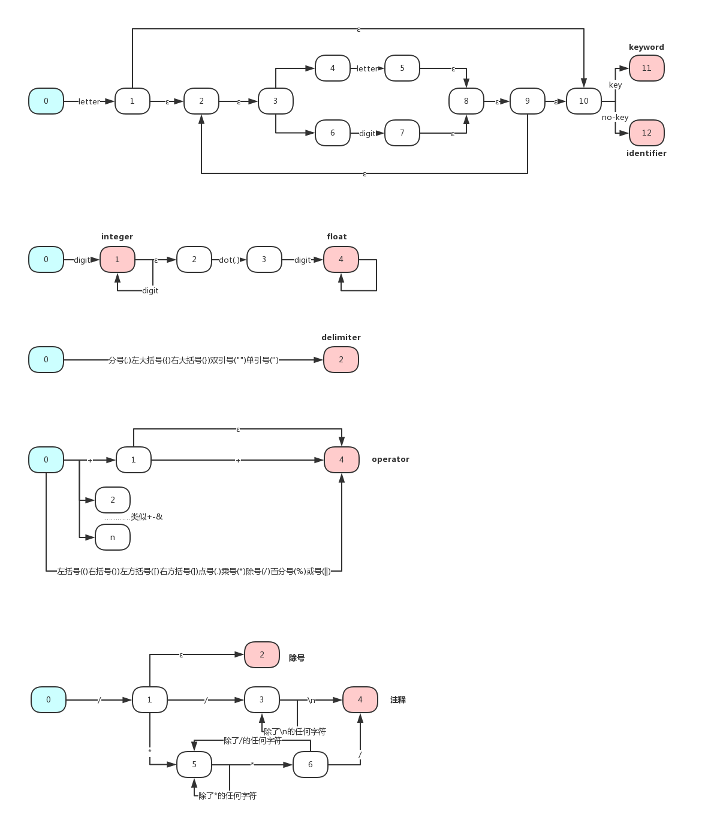

# 编译原理第一次实验报告

[TOC]

## 概述

​	这是编译原理的第一次实验报告

​	基本部分是第一部分:基于C语言子集的词法分析程序。这部分选取了C语言的一个子集给出了词法分析程序，对**给定的一段C语言代码(元素均在此子集中)**，输出是**该段代码的token序列**，以便后面的文法分析使用。

​	扩展部分是第二部分:LEX的部分实现。这部分对**给定的一个正则表达式**，**输出了其DFA的转化表**，由于时间所限，没有实现词法分析程序的生成程序。

## 实验环境

​	实验环境是**Windows10**系统，使用的语言是**Java**语言

## 第一部分: 基于C语言子集的词法分析程序

### 1. 假设与依赖

> 假设了实验使用的C语言子集
>
> 两个输入之间均用1个空格隔开

| Token     | 包含的输入                                    |
| --------- | ---------------------------------------- |
| **关键字**   | break case char const continue default do double else enum float for goto if int long short signed sizoef static switch unsigned void |
| **操作符**   | ( ) [ ] . ! + ++ - -- * / % < <= > >= = == != & && \|\| , |
| **分隔符**   | ; { }                                    |
| **注释符**   | // /* */ “ ” ‘ ’                         |
| **忽略的字符** | \n \t blank                              |
| **整数**    | 所有整数(包括负数)                               |
| **浮点数**   | 所有浮点数(包括负数)                              |
| **标识符**   | 由数字,大小写英文字母和和下划线组成的并且由字母或下划线开头的任意字符串(不包含关键字) |

### 2. 思路与方法

> 本部分叙述了实验的正则表达式构造和主要思路

#### 2.1 正则表达式的构造

分成两个部分

**第一部分是有限长度，有限数目的token**

| Token   | 正则表达式                                    |
| ------- | ---------------------------------------- |
| **关键字** | break\|case\|char\|const\|continue\|default\|do\|double\|else\|enum\|float\|for\|goto\|if\|int\|long\|short\|signed\|sizoef\|static\|switch\|unsigned\|void |
| **操作符** | (\|)\|[\|] .\|!\|+\|++\|-\|--\|*\|/\|%\|<\|<=\|>\|>=\|=\|==\|!=\|&\|&&\|\|\|\| , |
| **分隔符** | ;\|{\|}\|“\|”\|‘\|’                      |
| **注释符** | // \| /* \| */                           |

**第二个部分是无限长度，无限数目的token**

| Token   | 正则表达式                                   |
| ------- | --------------------------------------- |
| **整数**  | -?*digit*(*digit*)                      |
| **浮点数** | *digit* (*digit*)* . *digit* (*digit*)* |
| **标识符** | *letter*(*letter*\|*digit*)*            |

其中*digit*->0|1|2|3|4|5|6|7|8|9，letter->a|b|c…|z|A|B|C…|Z|_

#### 2.2 思路叙述

思路如下:

- 初始化常量
- 将文本的C程序代码读取成为**字节数组**
- 从左至右扫描**一遍**数组，利用**DFA**确定其归属的Token种类，并与原来的词法元素合并成为一个token，写入**输出字符串列表**中
- 将**输出字符串列表**中的字符串按照从前往后的顺序输出到文本

### 3. 自动状态机DFA构造描述

> 本部分详细叙述了从Regular Expression到DFA的过程

#### 3.1 RE->NFA

#### 3.2 NFA->DFA

### 4. 数据结构描述

### 5. 核心算法描述

### 6. 测试情况

## 第二部分:LEX部分实现

### 1. 假设与依赖

### 2. 思路与方法

### 3. 数据结构描述

### 4. 核心算法描述

### 5. 测试情况

## 困难与解决

## 总结与收获

## 参考文献

